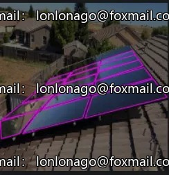
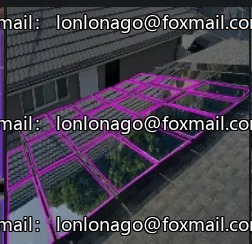
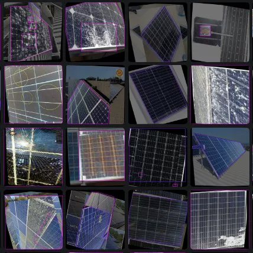
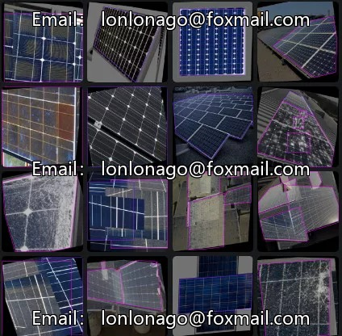
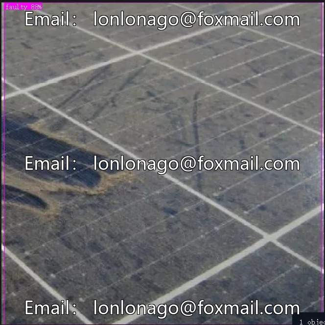

# YOLO PV module defect detection dataset

## Body

YOLO (You Only Look Once) is a deep learning model that is used for object detection. It is a very popular model in the field of computer vision. 

For the task of detecting defects on photovoltaic panels, there are several datasets available. One such dataset is the YOLOv3 dataset, which is specifically designed for this purpose. The dataset contains images of photovoltaic panels with various types of defects, and it is labeled with the location and type of the defect. 

The dataset can be downloaded from the official website of the YOLOv3 project. It is important to note that the dataset is not free, but it is worth it for researchers and developers who are interested in developing algorithms for detecting defects on photovoltaic panels.

(Full product description was not available from the source page.)

## Images

## Payment

Here is a pay link on Stripe ( https://buy.stripe.com/3cs8yP7sY87d0vu9AB ). Please contact me lonlonago@foxmail.com after funding $89, and I will send you a complete data files , thank you!

